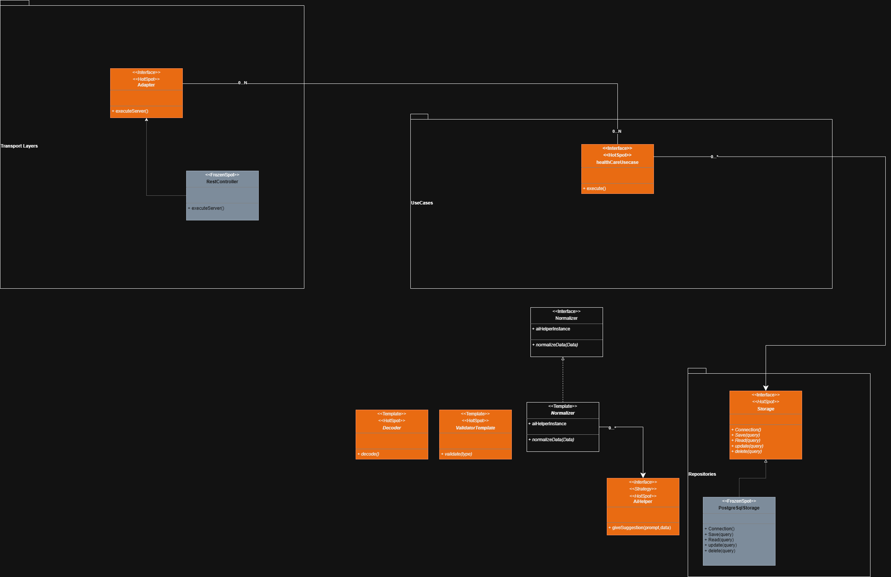

# HealthCare Interoperability framework

Small SDK project to host interoperability services and adapters.

## Folder Architecture

```text
documentation/
└─ frameworkClassDiagram.png
src/
└─ healthcare_sdk/
   ├─ app.py
   ├─ __init__.py
   ├─ contracts.py
   ├─ errors.py
   ├─ sdk.py
   ├─ transportLayer/
   │  ├─ adapter.py
   │  ├─ restController.py
   │  └─ __init__.py
   ├─ repositories/
   │  ├─ base.py
   │  ├─ messageLog.py
   │  ├─ postgreSqlStorage.py
   │  ├─ storage.py
   │  └─ __init__.py
   ├─ usecases/
   │  ├─ defaultHealthCareUsecase.py
   │  ├─ healthCareUsecase.py
   │  └─ __init__.py
   └─ tools/
      ├─ aiHelper.py
      ├─ decoder.py
      ├─ normalizer.py
      ├─ validator.py
      └─ __init__.py
```

## Proposed Class Diagram



Folder responsibilities:

- `contracts.py`: Shared data types (`RawMessage`, `MessageEnvelope`, `ValidationResult`, status constants).
- `errors.py`: SDK exception hierarchy (`SdkError`, `DecodeError`, `ValidationError`, `NormalizationError`, `StorageError`).
- `sdk.py`: `register_components` helper and `SdkComponents` dataclass.
- `transportLayer/`: Transport adapters and server launchers (e.g., REST, HL7 over MLLP).
- `repositories/`: Database providers and external data sources. Includes `base.py` (SQLAlchemy declarative base) and `messageLog.py` (ORM model for persisted envelopes).
- `usecases/`: Application use cases and orchestration logic. `defaultHealthCareUsecase.py` provides the built-in decode→validate→normalize→store pipeline.
- `tools/`: Shared helpers for decoding, validation, and normalization.

## Setup (uv)

```powershell
uv venv
uv add fastapi uvicorn
```

## Run

```powershell
$env:PYTHONPATH = "src"
python -m healthcare_sdk.app
```

Then open: http://127.0.0.1:8000/health

## Install

```powershell
pip install -e .
```

## SDK Entry Point

The framework provides a registration helper to import arrays of components that
implement the SDK Protocols.

```python
from healthcare_sdk import register_components, SdkComponents

components: SdkComponents = register_components(
    adapters=[...],
    usecases=[...],
    validators=[...],
    decoders=[...],
    normalizers=[...],
    aihelpers=[...],
    storages=[...],
)
```

## SDK Contracts

This document defines the generic envelope and component contracts for the SDK framework.

### Envelope

The framework standardizes a generic envelope that can carry HL7v2, FHIR, or other protocols.

```text
MessageEnvelope
  id: str
  protocol: str
  message_type: str
  raw_payload: str | bytes
  decoded_payload: dict | None
  normalized_payload: dict | None
  metadata: dict
  errors: list[ErrorDetail]
  status: str
```

#### Status values

- received
- decoded
- validated
- normalized
- stored
- error

### Types

```text
RawMessage
  id: str
  protocol: str
  raw_payload: str | bytes
  metadata: dict
  message_type: str | None

ErrorDetail
  code: str
  message: str
  stage: str
  context: dict | None

ValidationResult
  is_valid: bool
  errors: list[ErrorDetail]
```

### Component contracts

```text
Adapter
  executeServer(port=8000)
  receive() -> RawMessage

Decoder
  decode(raw_message: RawMessage) -> DecodedPayload

Validator
  validate(decoded_payload: DecodedPayload) -> ValidationResult

ValidatorTemplate (ABC + Validator)
  validate(decoded_payload: DecodedPayload) -> ValidationResult  # abstract

Normalizer
  normalizeData(decoded_payload: DecodedPayload) -> NormalizedPayload

NormalizerTemplate (ABC + Normalizer)
  normalizeData(decoded_payload: DecodedPayload) -> NormalizedPayload  # abstract

AiHelper
  generateResponse(prompt: str) -> str

HealthCareUsecase
  execute(raw_message: RawMessage) -> MessageEnvelope

HealthCareStorage
  save(envelope: MessageEnvelope) -> str
  connection() -> Any
  read(query: dict) -> dict
  delete(query: dict) -> bool
  update(query: dict, data: dict) -> bool
```

### Errors

```text
SdkError
  code: str
  message: str
  stage: str
  context: dict

DecodeError
ValidationError
NormalizationError
StorageError
```

## Hl7 v2 examples

ALl the examples were taken of this repository
```
https://github.com/Work-In-Progress-For-Health/hl7-v2-examples
```